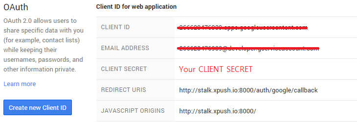

As running the session server as follows

	bin/xpush --port 8000 --config ./config.sample.json --session

Configuration file for running XPUSH has become json format. Learn more detail about setting.

	{
	  "zookeeper": {},
	  "redis": {},
	  "mongodb": {},
	  "oauth": {},
	  "apps" : []
	}

 

## System Configuration

You can set the zookeeper, redis, and mongodb configuration that will be used by XPUSH server.

### zookeeper

You can set the zookeeper that will be used by xpush server.

	"zookeeper":{"address":"127.0.0.1:2181"}

### redis

You can set the redis that will be used by XPUSH server.

	"redis":{"address":"127.0.0.1:6379"}

### mongodb

You can set the mongodb that will be used by xpush server.

	"mongodb":{"address":"127.0.0.1:27017"}

 

## Application Configuration

You can set the information about the Application to provide services through the XPUSH.

### oauth

You can add configuration for oauth. XPUSH is by using the Application information that has been registered by oauth provider, you can generate the event after LOGIN processing.

#### 1. facebook

Add the app id and app secret that are registered in facebook.

	"facebook": {
	  "key": "App ID Here",
	  "secret": "App Secret Here",
	  "event": {
	    "name": "login-facebook"
	  },
	  "callbackUrl":"",
	  "success": ""
	}

> ** Note **: the `Site URL` and callbackUrl that are registered in facebook will need to match. Default: /auth/facebook/callback

#### 2. twitter

Add the app key and app secret that are registered in twitter.

	"twitter": {
	  "key": "App key Here",
	  "secret": "App secret Here",
	  "event": {
	    "name": "login-twitter"
	  },
	  "callbackUrl":"",
	  "success": ""
	}

> ** Note **: the `Callback URL` and callbackUrl that are registered in twitter will need to match. Default: /auth/twitter/callback

#### 3. Google+

Add the client id and client secret that are registered in google console.

	"googleplus": {
	  "key": "CLIENT ID Here",
	  "secret": "CLIENT SECRET Here",
	  "event": {
	    "name": "login-google"
	  },
	  "callbackUrl":"",
	  "success": ""
	}

>** Note **: the `REDIRECT URIS` and callbackUrl that are registered in google console will need to match. Default: /auth/google/callback

### apps

You can set the application information and GCM or APN key that will be used by xpush server.

	"apps" : [
	  {
	    "id" : "applicationId Here",
	    "name": "application Name Here",

	    "notification": {
	      "gcm": {
			"apiKey": "Google API KEY for GCM Here"
	      },
	      "apn": {
			"apiKey": "APNS Key Here"
	      }
	    }
	  }
	]

 

## Runtime Configuration

You can set the option to use when you run the xpush.

####config

Specify the CONFIG FILE location to use when XPUSH server run.

	--config ./config.sampel.json

> **Note**: If you are running by using the docker you can be a file that was saved in the docker host using the ** -v ** option to be recognized by the docker container.
The following are the settings that you want to be able to recognize the `/home/stalk / data` location to the stored` session01.json` of the host in the internal docker container.

	-v /home/stalk/data:/data stalk/xpush:latest xpush --config /data/session01.json

####host

**Hostname  should be accessible URL.** Because the server is used when it is registered with the zookeeper. Default *** 127.0.0.1 ***

	--host www.sample.net

> ** Note **: If you are running by using the docker, if you do not set the host, xpush server will not be able to access because be set to the internal IP address of docker container. In this case, you must be sure to set the public IP or domain to host.

####port

The port to be used when XPUSH server is running. default *** 80 ***

	--port 8000

####session

Run the XPUSH server with *** SESSION *** mode. default *** CHANNEL ***

	--session

####silent

Run the XPUSH server with *** SILENT*** mode. It does not leave the Log.

	--silent

####data

You can set XPUSH server's data directory. The uploaded files are saved to that location.

	--data /data
