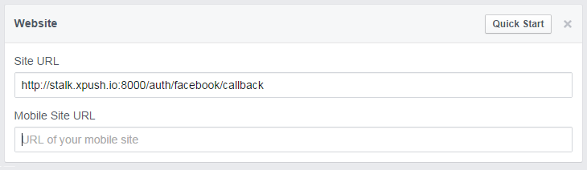
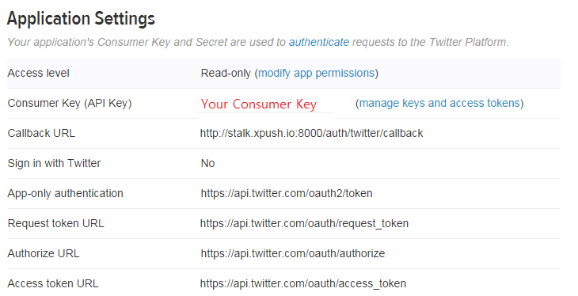

세션서버를 아래와 같이 실행 했듯이

	bin/xpush --port 8000 --config ./config.sample.json --session

XPUSH 를 실행하기 위해 설정파일은 json형태로 되어 있습니다. 설정에 대해 자세히 알아봅니다.

	{
	  "zookeeper": {},
	  "redis": {},
	  "mongodb": {},
	  "oauth": {},
	  "apps" : []
	}

 

## System Configuration

XPUSH가 사용할 zookeeper, redis, mongodb 정보를 설정합니다.

### zookeeper

xpush가 사용할 zookeeper의 주소를 설정합니다.

	"zookeeper":{"address":"127.0.0.1:2181"}

### redis

xpush가 사용할 redis의 주소를 설정합니다.

	"redis":{"address":"127.0.0.1:6379"}

### mongodb

xpush가 사용할 mongodb의 주소를 설정합니다.

	"mongodb":{"address":"127.0.0.1:27017"}

 

## Application Configuration

XPUSH를 통해 서비스할 Application에 대한 정보를 설정합니다.

### oauth

oauth provider를 설정을 추가합니다. XPUSH는 oauth provider에 등록된 Application 정보를 이용하여 LOGIN 처리 후 event를 발생시킬 수 있습니다.

#### 1. facebook

facebook에 등록한 App ID와 App Secret를 등록합니다.

	"facebook": {
	  "key": "App ID Here",
	  "secret": "App Secret Here",
	  "event": {
	    "name": "login-facebook"
	  },
	  "callbackUrl":"",
	  "success": ""
	}

>**Note**:facebook에 등록한 `Site URL`과 config의 callbackUrl이 일치해야합니다. Default : /auth/facebook/callback

#### 2. twitter

twitter에 등록한 App key와 App secret를 등록합니다.

	"twitter": {
	  "key": "App key Here",
	  "secret": "App secret Here",
	  "event": {
	    "name": "login-twitter"
	  },
	  "callbackUrl":"",
	  "success": ""
	}

>**Note**:Twitter에 등록한 `Callback URL`과 config의 callbackUrl이 일치해야합니다. Default : /auth/twitter/callback

#### 3. Google+

Google console에 등록한 CLIENT ID와 CLIENT SECRET를 등록합니다.

	"googleplus": {
	  "key": "CLIENT ID Here",
	  "secret": "CLIENT SECRET Here",
	  "event": {
	    "name": "login-google"
	  },
	  "callbackUrl":"",
	  "success": ""
	}

>**Note**:Twitter에 등록한 `REDIRECT URIS`과 config의 callbackUrl이 일치해야합니다. Default : /auth/google/callback

### apps

XPUSH 서버가 사용할 application정보와 GCM or APN key를 등록합니다.

	"apps" : [
	  {
	    "id" : "applicationId Here",
	    "name": "application Name Here",

	    "notification": {
	      "gcm": {
			"apiKey": "Google API KEY for GCM Here"
	      },
	      "apn": {
			"apiKey": "APNS Key Here"
	      }
	    }
	  }
	]

 

## Runtime Configuration

xpush를 실행할 때 사용할 option을 설정합니다.

####config

XPUSH server 실행될 때 사용할 CONFIG FILE 위치를 지정합니다.

	--config ./config.sampel.json

>**Note**:docker를 이용해 실행할 경우 docker의 **-v** option을 함께 사용해서 docker host에 저장한 파일을 docker container에서 인식이 가능하도록 할 수 있습니다.
아래는 host의 `/home/stalk/data` 위치에 저장한 `session01.json`을 docker container 내부에서 인식이 가능하도록 하는 설정입니다.

	-v /home/stalk/data:/data stalk/xpush:latest xpush --config /data/session01.json

####host

XPUSH server 실행될 때 사용할 hostname. zookeeper에 서버가 등록될 때 사용되기 때문에 **반드시 접근가능한 URL이어야 합니다.** default ***127.0.0.1***

	--host www.sample.net

>**Note**:docker를 이용해 실행할 경우 host를 설정하지 않으면, xpush server가 docker container의 내부 IP로 설정이 되서 접근이 불가능해집니다. 이 경우 반드시 public IP나 domain을 host 로 설정해야합니다.

####port

XPUSH server가 실행될 때 사용할 PORT. default ***80***

	--port 8000

####session

XPUSH server 실행될 때 ***SESSION*** mode로 실행한다. default ***CHANNEL***

	--session

####silent

XPUSH server 실행될 때 ***SILENT*** mode로 실행한다. Log를 남기지 않습니다.

	--silent

####data

XPUSH server가 사용할 data directory를 설정합다. 업로드한 파일들이 해당 위치에 저장됩니다.

	--data /data
